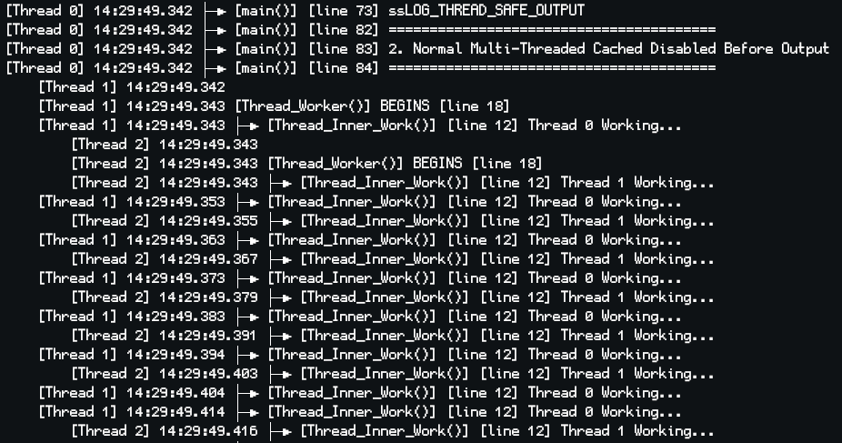

# ssLogger 📔
A lightweight, flexible C++11 logging library with call stack tracking and multi-threading support.


## ✨ Key Features

- 🗒️ **Call Stack Tracking**: Full function call stack visualization
- 🎯 **Multiple Log Levels**: FATAL, ERROR, WARNING, INFO, DEBUG with runtime control
- 🧵 **Thread Safety**: Built-in support for multi-threaded applications
- 🔄 **Log Rotation**: Automatic file rotation based on size with configurable retention
- 🚀 **Minimal Dependencies**: Header-only or CMake integration (C++11 compatible)
- ⚡ **High Performance**: Optional caching and configurable thread safety
- 🛠️ **Highly Configurable**: Extensive compile-time and runtime options

## 📸 Quick Look

### Call Stack Visualization


### Simple Function Logging


### Thread-Safe Logging


### Log Levels


## 🚀 Getting Started

### Installation

1. Add ssLogger to your project:
    ```shell
    git submodule add https://github.com/Neko-Box-Coder/ssLogger.git
    # OR
    git clone https://github.com/Neko-Box-Coder/ssLogger.git
    ```

2. Choose your integration method:

    #### CMake Integration
    ```cmake
    add_subdirectory(path/to/ssLogger)
    target_link_libraries(YourTarget PUBLIC ssLogger)
    ```

    #### Header-Only Usage
    1. Add `include/ssLogger` to your include paths
    2. Include in your entry point (once):
      ```cpp
      #include "ssLogger/ssLogInit.hpp"
      #include "ssLogger/ssLog.hpp"
      ```
    3. Define macro options you want before including `ssLog.hpp`. 
    
    > 📝 For a complete list of options, see [Compile Time Configurations](#%EF%B8%8F-compile-time-configurations) below.

> ⚠️ **Warning**: Do not use ssLogger before main() as it uses global static variables.

## 💻 Usage

### Simple Line Logging
```cpp
ssLOG_LINE("Hello, World!");
ssLOG_LINE("Value: " << 42);

//Log levels
ssLOG_FATAL("Critical error!");
ssLOG_ERROR("Error occurred");
ssLOG_WARNING("Warning message");
ssLOG_INFO("Information");
ssLOG_DEBUG("Debug info");

//Set runtime log level for current thread
ssLOG_SET_CURRENT_THREAD_TARGET_LEVEL(ssLOG_LEVEL_ERROR);

//Get current thread's target log level
int level = ssLOG_GET_CURRENT_THREAD_TARGET_LEVEL();
```

### Function Call Tracking
```cpp
void ProcessData()
{
    ssLOG_FUNC();  //Automatically logs function entry/exit
    ssLOG_LINE("Processing...");
}

//Custom function name (great for lambdas)
auto handler = []() 
{
    ssLOG_FUNC("CustomHandler");
    //... code ...
};

//Function tracking with different log levels
ssLOG_FUNC_ERROR("Critical operation");
ssLOG_FUNC_WARNING("Important operation");
ssLOG_FUNC_INFO("Normal operation");
```

### Log Caching And Thread Control

Caching is useful for situations where a lot of logs are being output in multiple threads. 

This allows better performance by avoiding having multiple threads waiting for synchronization to
output to file/console but instead save to local thread cache.

Cache can all be output either in chronological order or grouped by thread at a later time.

```cpp
//Cache in current scope
ssLOG_CACHE_OUTPUT_IN_SCOPE();

//Global cache control
ssLOG_ENABLE_CACHE_OUTPUT();   //Enable for all threads
ssLOG_DISABLE_CACHE_OUTPUT();  //Disable for all threads

//Thread-specific cache control
ssLOG_ENABLE_CACHE_OUTPUT_FOR_CURRENT_THREAD();   //Enable for current thread
ssLOG_DISABLE_CACHE_OUTPUT_FOR_CURRENT_THREAD();  //Disable for current thread

bool isCaching = ssLOG_IS_CACHE_OUTPUT_FOR_CURRENT_THREAD();  //Check if current thread is caching

//New thread cache control
ssLOG_ENABLE_CACHE_OUTPUT_FOR_NEW_THREADS();   //Enable for new threads
ssLOG_DISABLE_CACHE_OUTPUT_FOR_NEW_THREADS();  //Disable for new threads

//Reset all thread information
ssLOG_RESET_ALL_THREAD_INFO();   //Clear all thread info and reset thread ID counter

//Output cached logs
ssLOG_OUTPUT_ALL_CACHE();           //Output all cached logs
ssLOG_OUTPUT_ALL_CACHE_GROUPED();   //Output grouped by thread

//Combine caching with log levels
ssLOG_CACHE_OUTPUT_IN_SCOPE();
ssLOG_ERROR("This error will be cached");
ssLOG_WARNING("This warning will be cached");
```

### Log File Control
By default, when `ssLOG_MODE` is set to `ssLOG_MODE_FILE` or `ssLOG_MODE_CONSOLE_AND_FILE`,
the output log file is `<Weekday> <Month> <Day> <Hour>_<Minutes>_<Seconds> <Year>_log.txt`

```cpp
ssLOG_ENABLE_LOG_TO_FILE(false);                    //Turns off logging to file at runtime
bool loggingToFile = ssLOG_IS_LOG_TO_FILE_ENABLED();

ssLOG_SET_LOG_FILENAME("custom_log_file.txt");      //Sets output log file at runtime
std::string logfile = ssLOG_GET_LOG_FILENAME();
```

### Log Rotation
Automatically rotate log files when they exceed a specified size to prevent disk space issues.
Log rotation is **disabled by default** and must be enabled at runtime. 
By default when enabled, it will rotate with 5 log files and each log file has a 5 MB limit.

```cpp
ssLOG_ENABLE_ROTATION(true);        //Enable log rotation

ssLOG_SET_MAX_LOG_SIZE_MB(10);      //10 MB
ssLOG_SET_MAX_LOG_SIZE_MB(0.5);     //500 KB

ssLOG_SET_MAX_ROTATED_FILES(10);    //Maximum number of rotated files to keep (default: 5)

//Check current rotation settings
bool rotationEnabled = ssLOG_IS_ROTATION_ENABLED();
double maxSize = ssLOG_GET_MAX_LOG_SIZE_MB();
int maxFiles = ssLOG_GET_MAX_ROTATED_FILES();
size_t currentBytes = ssLOG_GET_CURRENT_FILE_SIZE();    //Current file size in bytes

//Delete all rotated files
ssLOG_CLEAR_ROTATED_FILES();
```

## 🔍 Advanced Features

<!-- 

### Raw Output and Custom Implementation
```cpp
//Basic output without formatting and thread safe checks
//Expects stream operations (<<)
ssLOG_BASE("Hello" << 42);  

//Custom implementation example
static std::mutex logMutex;
static std::ofstream logFile("app.log", std::ios::app);

void my_custom_log(const std::string& message) 
{
    std::lock_guard<std::mutex> lock(logMutex);
    std::cout << "[Custom] " << message << std::endl;
    logFile << "[Custom] " << message << std::endl;
}

void my_custom_flush()
{
    std::lock_guard<std::mutex> lock(logMutex);
    logFile.flush();
}

#undef ssLOG_BASE
#define ssLOG_BASE(message) \
    do { \
        std::stringstream ss; \
        ss << message; \
        my_custom_log(ss.str()); \
    } while(0)

#undef ssLOG_FLUSH
#define ssLOG_FLUSH() my_custom_flush()
```

-->

### Benchmarking
```cpp
auto benchmark = ssLOG_BENCH_START("Operation");    //Starting benchmark "Operation"
//Or `auto benchmark = ssLOG_BENCH_START_SILENT("Operation");` to not log the start of benchmark
//... code to benchmark ...
ssLOG_BENCH_END(benchmark);                         //Benchmark "Operation" took 116 milliseconds

//The `auto` here is just std::pair<std::string, 
//                                  std::chrono::time_point<std::chrono::high_resolution_clock>>

//Benchmarking with different log levels
auto benchError = ssLOG_BENCH_START_ERROR("Critical Operation");
//... code ...
ssLOG_BENCH_END_ERROR(benchError);
```

### Content Logging
```cpp
ssLOG_CONTENT( ProcessData(userID, username, password) );

//Content logging with different log levels
ssLOG_CONTENT_WARNING( RiskyOperation() );
```

### Log Flush
Flushes the output buffer to the console or file.
```cpp
ssLOG_FLUSH();
```

### Log Prepending
Prepends additional message to the log
```cpp
ssLOG_PREPEND("My prepend message");
ssLOG_LINE("Test"); //"My prepend message" will be prepended for current thread

ssLOG_PREPEND_RESET();
ssLOG_LINE("Test"); //Normal log message
```

### Precise Function Exit Log
Using `ssLOG_FUNC_ENTRY` and `ssLOG_FUNC_EXIT` will give you the line number of the exit log.

```cpp
void ProcessTransaction(int amount) 
{
    ssLOG_FUNC_ENTRY();
    ssLOG_LINE("Processing amount: " << amount);
    
    if(amount <= 0)
    {
        ssLOG_ERROR("Invalid amount");
        ssLOG_FUNC_EXIT();
        return;
    }
    
    //...processing...
    ssLOG_FUNC_EXIT();
}
```

## ⚙️ Compile Time Configurations

These options can be configured either as CMake options or simply as defines before including ssLogger header.

For exact definitions, checkout [ssLogSwitches.hpp](https://github.com/Neko-Box-Coder/ssLogger/blob/main/Include/ssLogger/ssLogSwitches.hpp)

| Define Macro Name | Default | Description |
|-------------------|---------|-------------|
| ssLOG_CALL_STACK | 1 | Show call stack for logged functions |
| ssLOG_LOG_WITH_ASCII | 0 | Use ASCII-only characters |
| ssLOG_SHOW_FILE_NAME | 1 | Show file name (⚠️ contains full path) |
| ssLOG_SHOW_LINE_NUM | 1 | Show line numbers |
| ssLOG_SHOW_FUNC_NAME | 1 | Show function names |
| ssLOG_SHOW_DATE | 0 | Show log date |
| ssLOG_SHOW_TIME | 1 | Show log time |
| ssLOG_THREAD_SAFE_OUTPUT | 1 | Enable thread-safe output |
| ssLOG_SHOW_THREADS | 1 | Show thread IDs |
| ssLOG_MODE | 0 | Log mode for ssLogger (0: CONSOLE, 1: FILE, 2: CONSOLE_AND_FILE) |
| ssLOG_USE_ESCAPE_SEQUENCES | 0 | Force use of escape sequences |
| ssLOG_PREPEND_LOC | 0 | Where to insert preprend (0: BEFORE_FUNC_NAME, 1: BEFORE_FILE_NAME, 2: BEFORE_MESSAGE) |
| ssLOG_LEVEL | 3 | Compile-time log level (0:NONE, 1:FATAL, 2:ERROR, 3:WARNING, 4:INFO, 5:DEBUG) |
| ssLOG_USE_WINDOWS_COLOR | 0 | Force use of Windows color codes |
| ssLOG_THREAD_VSPACE | 4 | Vertical space between individual threads outputs |
| ssLOG_IMMEDIATE_FLUSH | 0 | Flush the log output immediately for each log (⚠️ may affect performance) |
| ssLOG_CALL_STACK_ONLY | 0 | Only show function call stack logs, other logs will be ignored |
| ssLOG_DISABLE_LOGS | 0 | Disable all logging operations |

## 🤝 Credits
Powered by [termcolor](https://github.com/ikalnytskyi/termcolor) ([license](./External/termcolor%20LICENSE))

## 🔜 TODOs:
- Add script for running tests in different configurations
