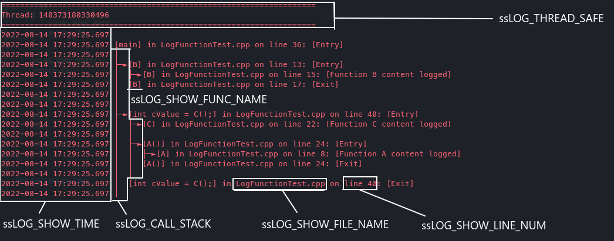
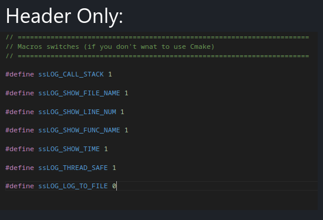
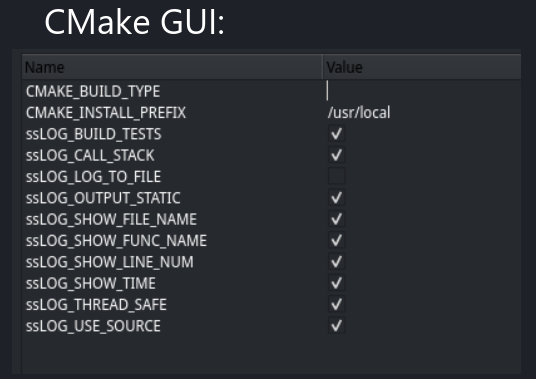

# ssLogger 📔

Super simple macro based Logger for call stack and quick debug logging, with minimum dependencies, high flexiblity and works with C++ 11 or above.

#### Both header only or CMake option available.

#### 🗒️ Fully verbose with call stack?


#### 👟 Simple logging with just function name and line number?


#### 🧵 Thread-safety for multithreading? (Can be disabled for performance)


#### 🔧 Easy Customization:




----

## 🔨 Usage:

### Logging a line:
```c++
// Output:
// 2022-08-14 16:49:53.802 [MethodName] in FileName.cpp on line 9
ssLOG_LINE();

// Output:
// 2022-08-14 16:49:53.802 [MethodName] in FileName.cpp on line 9: [Here's some value: 42]
int someValue = 42;
ssLOG_LINE("Here's some value: "<<someValue);
```

### Logging functions call stack (*inline macro*):
```c++
//***Functions call stack are only logged when ssLOG_CALL_STACK is true***

void A()
{
    //...
}

int B()
{
    //...
    return 42;
}

int main()
{
    // Or without space
    ssLOG_FUNC_CONTENT( A() );
    
    ssLOG_FUNC_CONTENT( int retVal = B() );

    // Or you can format it like this to log more than 1 statements!
    ssLOG_FUNC_CONTENT
    (
         int retVal = B();
         // Some other statements...
    );

    return 0;
}

```

### Logging functions call stack (*With automatic macro*):

```c++
//***Functions call stack are only logged when ssLOG_CALL_STACK is true***

//Log function callstack with ssLOG_FUNC
void B()
{
    ssLOG_FUNC();

    //...
}

int C(bool b)
{
    ssLOG_FUNC();
    
    //...

    if(b)
        return 42;

    //...

    return 43;
}

//You can also have custom names for functions as well, which is useful for lambda functions.
auto lambda = []()
{
    ssLOG_FUNC("My lambda function");

    //...
};
```

----

### How to use:
1. Clone this repository
2. Decide if you want to use this with header-only or with source
    - Header only:
        1. Edit & include `include/ssLogSwitches.hpp` as you like
        2. Include `include/ssLogger/ssLog.hpp` to your header(s) below `ssLogSwitches.hpp`
        3. Include `include/ssLogger/ssLogInit.hpp` to your entry point **ONCE**
    - Source with CMake:
        1. Add `add_subdirectory(<path to ssLogger> <optional binary directory>)` to your `CMakeLists.txt`
        2. Link ssLogger with your target. `target_link_libraries(<Your Target> PUBLIC ssLogger)`
        3. Add `#include "ssLogger/ssLog.hpp"` to your header(s)
        4. Edit properties via CMake GUI or command line

> <font size="4">⚠️ **Warning:** Using ssLogger before main (i.e. inside static class initialization) will result undefined behaviour (as ssLogger uses global static variable).</font>

----

### Dependencies:

No external library dependencies, only standard library is used.

- Common dependencies
    - `#include <sstream>`
    - `#include <string>`
    - `#include <stack>`
- ssLOG_THREAD_SAFE
    - `#include <unordered_map>`
    - `#include <thread>`
    - `#include <mutex>`
- ssLOG_LOG_TO_FILE
    - True: `#include <fstream>`, `#include <ctime>`
    - False: `#include <iostream>`
- ssLOG_SHOW_TIME
    - `#include <chrono>`
    - `#include <sstream>`
    - `#include <iomanip>`
    - `#include <ctime>`

----

### 🔜 TODOs:
- Add option for only showing time instead of both date and time
- Add executable to merge thread logs together