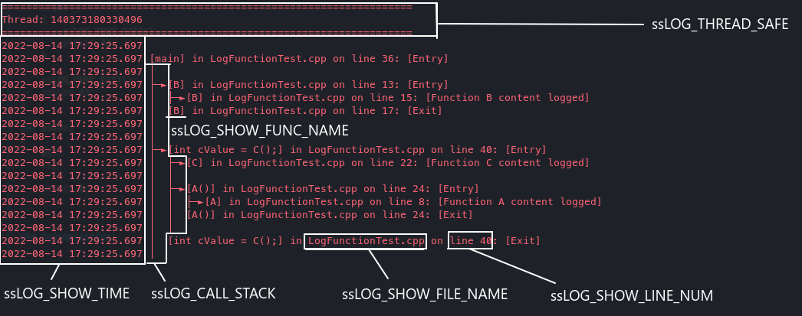

# ssLogger 📔

Super simple macro based Logger for call stack and quick debug logging, with minimum dependencies, high flexiblity and works with C++ 11 or above.

#### Both header only or CMake option available.

#### Fully verbose with call stack?


#### Simple logging with just function name and line number?


#### Thread-safety for multithreading? (Can be disabled for performance)


#### Easy Customization:



## Usage:

### Logging a line:
```c++
// Output:
// 2022-08-14 16:49:53.802 [MethodName] in FileName.cpp on line 9
ssLOG_LINE();

// Output:
// 2022-08-14 16:49:53.802 [MethodName] in FileName.cpp on line 9: [Here's some value: 42]
int someValue = 42;
ssLOG_LINE("Here's some value: "<<someValue);
```

### Logging a function:
```c++
void A()
{
    ssLOG_LINE("Function A content logged");
}

int B()
{
    return 42;
}

int main()
{
    // Or without space
    ssLOG_FUNC( A() );
    
    // You can log 1 or more statements too!
    ssLOG_FUNC( int retVal = B() );

    // Or you can format it like this
    // ssLOG_FUNC
    // (
    //     int retVal = B();
    // );

    return 0;
}

```

### Alternatively:

```c++
//Wrap function with ssLOG_FUNC_ENTRY and ssLOG_FUNC_EXIT
void B()
{
    ssLOG_FUNC_ENTRY();

    ssLOG_LINE("Function B content logged");
    
    ssLOG_FUNC_EXIT();
}

//Remember to add ssLOG_FUNC_EXIT before return statements as well
int C(bool b)
{
    ssLOG_FUNC_ENTRY();
    
    ssLOG_LINE("Function C content logged");
    if(b)
    {
        ssLOG_FUNC_EXIT();
        return 42;
    }

    ssLOG_FUNC_EXIT();
    return 43;
}

int main()
{
    B();
    C();

    //You can also have custom names for functions as well.
    auto lambda = []()
    {
        ssLOG_FUNC_ENTRY("Custom lambda");
        ssLOG_FUNC_EXIT("Custom lambda");
    };

    return 0;
}
```

### How to use:
1. Clone this repository
2. Decide if you want to use this with header-only or with source
    - Header only:
        1. Include `ssLogger/include/ssLog.hpp` to your header(s)
        2. Include `ssLogger/include/ssLogInit.hpp` to your entry point **ONCE**
        3. Edit `ssLogger/include/ssLogSwitches.hpp` as you like
    - Source with CMake:
        1. Add `add_subdirectory(<path to ssLogger>)` to your `CMakeList.txt`
        2. Link ssLogger with your target. `target_link_libraries(<Your Target> PUBLIC ssLogger)`
        3. Edit properties via CMake GUI or command line

### Dependencies:

No external library dependencies, only standard library is used.

- Common dependencies
    - `#include <string>`
    - `#include <stack>`
- ssLOG_THREAD_SAFE
    - `#include <unordered_map>`
    - `#include <thread>`
    - `#include <mutex>`
- ssLOG_LOG_TO_FILE
    - True: `#include <fstream>`
    - False: `#include <iostream>`
- ssLOG_SHOW_FILE_NAME
    - `#include <ctime>`
- ssLOG_SHOW_TIME
    - `#include <chrono>`
    - `#include <sstream>`
    - `#include <iomanip>`