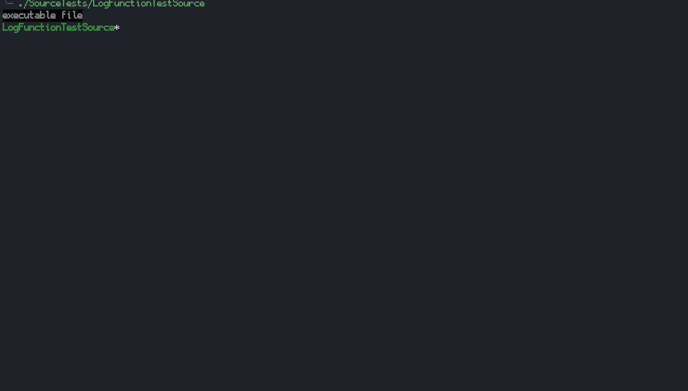
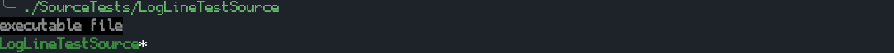

# ssLogger 📔
A lightweight, flexible C++11 logging library with call stack tracking and multi-threading support.


## ✨ Key Features

- 🗒️ **Call Stack Tracking**: Full function call stack visualization
- 🎯 **Multiple Log Levels**: FATAL, ERROR, WARNING, INFO, DEBUG with runtime control
- 🧵 **Thread Safety**: Built-in support for multi-threaded applications
- 🚀 **Minimal Dependencies**: Header-only or CMake integration
- ⚡ **High Performance**: Optional caching and configurable thread safety
- 🛠️ **Highly Configurable**: Extensive compile-time and runtime options

## 📸 Quick Look

### Call Stack Visualization


### Simple Function Logging


### Thread-Safe Logging


### Log Levels


## 🚀 Getting Started

### Installation

1. Add ssLogger to your project:
    ```shell
    git submodule add https://github.com/Neko-Box-Coder/ssLogger.git
    # OR
    git clone https://github.com/Neko-Box-Coder/ssLogger.git
    ```

2. Choose your integration method:

    #### CMake Integration
    ```cmake
    add_subdirectory(path/to/ssLogger)
    target_link_libraries(YourTarget PUBLIC ssLogger)
    ```

    #### Header-Only Usage
    1. Add `include/ssLogger` to your include paths
    2. Include in your entry point (once):
      ```cpp
      #include "ssLogger/ssLogInit.hpp"
      #include "ssLogger/ssLog.hpp"
      ```
    3. Define macro options you want before including `ssLog.hpp`. See [Configuration](#configuration) for all options.

> ⚠️ **Warning**: Do not use ssLogger before main() as it uses global static variables.

## 💻 Basic Usage

### Simple Line Logging
```cpp
ssLOG_LINE("Hello, World!");  //Basic logging
ssLOG_LINE("Value: " << 42);  //Stream-style logging

//Different log levels
ssLOG_FATAL("Critical error!");
ssLOG_ERROR("Error occurred");
ssLOG_WARNING("Warning message");
ssLOG_INFO("Information");
ssLOG_DEBUG("Debug info");

//Set runtime log level for current thread
ssLOG_SET_CURRENT_THREAD_TARGET_LEVEL(ssLOG_LEVEL_ERROR);
```

### Function Call Tracking
```cpp
void ProcessData()
{
    ssLOG_FUNC();  //Automatically logs function entry/exit
    ssLOG_LINE("Processing...");
}

//Custom function name (great for lambdas)
auto handler = []() 
{
    ssLOG_FUNC("CustomHandler");
    //... code ...
};

//Function tracking with different log levels
ssLOG_FUNC_ERROR("Critical operation");
ssLOG_FUNC_WARNING("Important operation");
ssLOG_FUNC_INFO("Normal operation");
```

### Log Caching And Thread Control
```cpp
//Cache in current scope
ssLOG_CACHE_OUTPUT_IN_SCOPE();

//Global cache control
ssLOG_ENABLE_CACHE_OUTPUT();   //Enable for all threads
ssLOG_DISABLE_CACHE_OUTPUT();  //Disable for all threads

//Thread-specific cache control
ssLOG_ENABLE_CACHE_OUTPUT_FOR_CURRENT_THREAD();   //Enable for current thread
ssLOG_DISABLE_CACHE_OUTPUT_FOR_CURRENT_THREAD();  //Disable for current thread

//New thread cache control
ssLOG_ENABLE_CACHE_OUTPUT_FOR_NEW_THREADS();   //Enable for new threads
ssLOG_DISABLE_CACHE_OUTPUT_FOR_NEW_THREADS();  //Disable for new threads

//Output cached logs
ssLOG_OUTPUT_ALL_CACHE();           //Output all cached logs
ssLOG_OUTPUT_ALL_CACHE_GROUPED();   //Output grouped by thread

//Combine caching with log levels
ssLOG_CACHE_OUTPUT_IN_SCOPE();
ssLOG_ERROR("This error will be cached");
ssLOG_WARNING("This warning will be cached");
```

## ⚙️ Configuration

### Key Configuration Options

| Option | Default | Description |
|--------|---------|-------------|
| ssLOG_CALL_STACK | 1 | Enable function call stack tracking |
| ssLOG_THREAD_SAFE_OUTPUT | 1 | Enable thread-safe output |
| ssLOG_LEVEL | 3 | Compile-time log level (0:NONE to 5:DEBUG) |
| ssLOG_LOG_TO_FILE | 0 | Enable file logging |
| ssLOG_SHOW_DATE | 0 | Show date in logs |
| ssLOG_SHOW_TIME | 1 | Show time in logs |

> 📝 For a complete list of options, see [Configuration Details](#configuration-details) below.

## 🔍 Advanced Features

### Raw Output and Custom Implementation
```cpp
//Basic output without formatting and thread safe checks
//Expects stream operations (<<)
ssLOG_BASE("Hello" << 42);  

//Custom implementation example
static std::mutex logMutex;
static std::ofstream logFile("app.log", std::ios::app);

void my_custom_log(const std::string& message) 
{
    std::lock_guard<std::mutex> lock(logMutex);
    std::cout << "[Custom] " << message << std::endl;
    logFile << "[Custom] " << message << std::endl;
}

#undef ssLOG_BASE
#define ssLOG_BASE(message) \
    do { \
        std::stringstream ss; \
        ss << message; \
        my_custom_log(ss.str()); \
    } while(0)
```

### Precise Function Exit Log
Using `ssLOG_FUNC_ENTRY` and `ssLOG_FUNC_EXIT` will give you the line number of the exit log.

```cpp
void ProcessTransaction(int amount) 
{
    ssLOG_FUNC_ENTRY();
    ssLOG_LINE("Processing amount: " << amount);
    
    if(amount <= 0)
    {
        ssLOG_ERROR("Invalid amount");
        ssLOG_FUNC_EXIT();
        return;
    }
    
    //...processing...
    ssLOG_FUNC_EXIT();
}
```

### Benchmarking
```cpp
auto benchmark = ssLOG_BENCH_START("Operation");
//... code to benchmark ...
ssLOG_BENCH_END(benchmark);

//Benchmarking with different log levels
auto benchError = ssLOG_BENCH_ERROR("Critical Operation");
//... code ...
ssLOG_BENCH_END(benchError);
```

### Content Logging
```cpp
ssLOG_CONTENT( ProcessData(userID, username, password) );

//Content logging with different log levels
ssLOG_CONTENT_WARNING( RiskyOperation() );
```

## 📚 Configuration Details

<details>
<summary>Click to expand full configuration options</summary>

| Define Macro Name | Default | Description |
|-------------------|---------|-------------|
| ssLOG_CALL_STACK | 1 | Show call stack for logged functions |
| ssLOG_LOG_WITH_ASCII | 0 | Use ASCII-only characters |
| ssLOG_SHOW_FILE_NAME | 1 | Show file name (⚠️ contains full path) |
| ssLOG_SHOW_LINE_NUM | 1 | Show line numbers |
| ssLOG_SHOW_FUNC_NAME | 1 | Show function names |
| ssLOG_SHOW_DATE | 0 | Show log date |
| ssLOG_SHOW_TIME | 1 | Show log time |
| ssLOG_THREAD_SAFE_OUTPUT | 1 | Enable thread-safe output |
| ssLOG_SHOW_THREADS | 1 | Show thread IDs |
| ssLOG_LOG_TO_FILE | 0 | Enable file logging |
| ssLOG_USE_ESCAPE_SEQUENCES | 0 | Force use of escape sequences |
| ssLOG_LEVEL | 3 | Compile-time log level (0:NONE, 1:FATAL, 2:ERROR, 3:WARNING, 4:INFO, 5:DEBUG) |
| ssLOG_USE_WINDOWS_COLOR | 0 | Force use of Windows color codes |
| ssLOG_THREAD_VSPACE | 4 | Vertical space between individual threads outputs |

</details>

## 🤝 Credits
Powered by [termcolor](https://github.com/ikalnytskyi/termcolor) ([license](./External/termcolor%20LICENSE))

## 🔜 TODOs:
- Add script for running tests in different configurations
